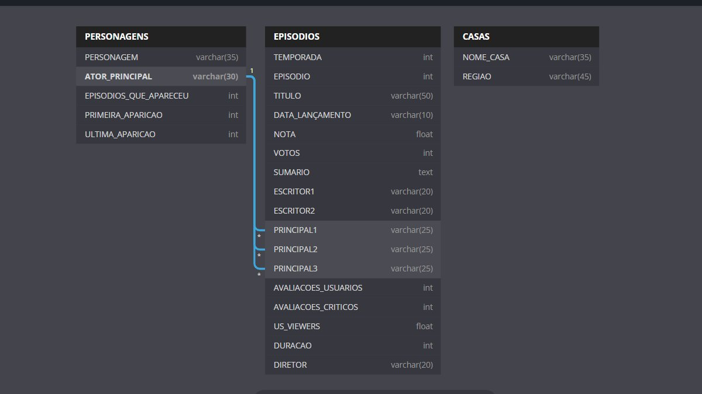
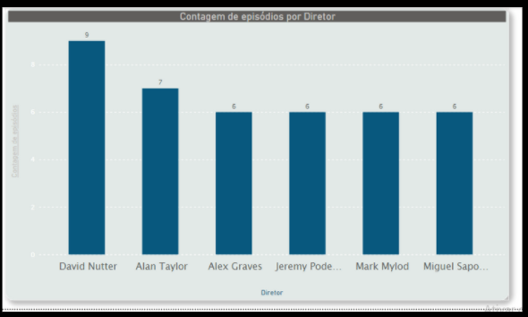
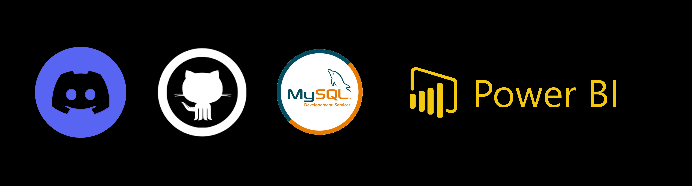

<div align="center">
    <h1>Projeto de Final de Módulo</h1>
    <h2>Resília, 3º Módulo</h2>
<<<<<<< HEAD
</div> 


=======
    
</div> 


>>>>>>> 12cda2852d3d58b43661aff6c397c2adcc069c92


#### Game of Thrones Dataset

Esse projeto utiliza dados sobre a série de televisão Game Of Thrones disponibilizados em .CSV afim de retirar informações relevantes a respeito da série. 

No total, são 3 tabelas que nos fornecem os seguintes dados:


* Personagens 

  * Nome do personagem
  * Nome do Ator 
  * Quantidade de episódios que apareceu
  * Primeira aparição
  * Ultima aparição

  Exemplo: 

  | Nome               | Nome do Ator   | Aparições | Primeira Aparição | Última aparição |
  | ------------------ | -------------- | --------- | ----------------- | --------------- |
  | Tyrion Lannister   | Peter Dinklage | 67        | 2011              | 2019            |
  | Cersei Lannister   | Lena Headey    | 62        | 2011              | 2019            |
  | Daenerys Targaryen | Emilia Clarke  | 62        | 2011              | 2019            |

  

* Episódios    

  * Temporada
  * Episódio(1, 2 , 3...)
  * Título do episódio
  * Data de Lançamento
  * Nota
  * Votos
  * Sumário
  * Escritor 1
  * Escritor 2
  * Principal 1
  * Principal 2
  * Principal 3
  * Avaliações dos Telespectadores
  * Avaliação de críticos
  * Visualizações
  * Duração
  * Diretor

Exemplo:  (Reduzido, senão fica muito grande, rs)

| Temporada | Episódios | Título              | Data Lançamento | Notas | Votos |
| --------- | --------- | ------------------- | --------------- | ----- | ----- |
| 1         | 1         | Winter is Coming    | 17-Apr-11       | 9.1   | 38639 |
| 2         | 1         | The North Remembers | 1-Apr-12        | 8.8   | 24837 |
| 3         | 1         | Valar Dohaeris      | 31-Mar-13       | 8.8   | 24808 |


* Casas 
  * Nome
  * Região

Exemplo: 

| Nome                  | Região      |
| --------------------- | ----------- |
| Algood                | Westerlands |
| Allyrion of Godsgrace | Dorne       |


## Diagrama 

Nós utilizamos o site [dbdiagram]([dbdiagram.io - Database Relationship Diagrams Design Tool](https://dbdiagram.io/home)) para criarmos uma visualização mais simples e relacional com os dados. Ao observarmos as tabelas de Game Of Thrones, não conseguimos estabelecer muitos relacionamentos (Chaves estrangeiras) entre elas. Somente observamos que poderia ser interessante relacionarmos o nome do Ator contido na tabela `personagens` com o nome dos atores principais contidos na tabela `episodios`

<<<<<<< HEAD

=======

>>>>>>> 12cda2852d3d58b43661aff6c397c2adcc069c92


## Queries e Gráficos

<h3 align="center"> Quantidade de casas por Região <h3>

```sql

SELECT `REGIAO`,COUNT(*) AS TOTAL 
FROM `CASAS` GROUP BY `REGIAO` 
ORDER BY TOTAL DESC;
```


<h3 align="center">Top 5 personagens principais </h3>


```sql
SELECT * FROM `PERSONAGENS` WHERE `EPISODIOS_QUE_APARECEU` > 50
ORDER BY `EPISODIOS_QUE_APARECEU` DESC LIMIT 5;
```


<h3 align="center">Qual diretor dirigiu mais episódios</h3>

```sql
SELECT `DIRETOR`, COUNT(*) AS TOTAL  
FROM `EPISODIOS` GROUP BY `DIRETOR` 
ORDER BY TOTAL DESC;
```




<h3 align="center"> Top 3 temporadas mais longas </h3>

```sql
SELECT `TEMPORADA` , sum(`DURACAO`)
 AS `DURACAO DA TEMPORADA` 
 FROM `EPISODIOS` 
 GROUP BY `TEMPORADA` 
 ORDER BY `DURACAO DA TEMPORADA` DESC LIMIT 3;
```


## Relatório do projeto

#### Encontros, organização e ferramentas

Esse projeto foi um ensinamento sobre a perseverança e a desistência! 

Inicialmente escolhemos o tema Lego para trabalharmos em cima, e logo no inicio enfretamos muitos problemas com a importação das tabelas e gastamos um bom tempo nisso, muito tempo mesmo.

Então decidimos depois de dias e noites mal dormidas tentando entender porque não dava certo, trocar de tema, então escolhemos trabalhar em cima do Super Mario Maker Dataset e tentamos e tentamos muito, e continuavamos enfrentando problema na importação da tabela, infelizmente.

Então, caimos na real e percebemos que não dava pra gastar mais tempo tentando e ai, finalmente, decidimos ficar com Game Of Thrones, pois as tabelas eram pequenas e depois dessa decisão tudo fluiu perfeitamente (Deus, que arrependimento de não ter decidido antes haha).

Durante esse processo de problemas infinitos, nós ficamos basicamente todos os dias em chamada pelo discord. Inicialmente nós queriamos usar o Trello e chegamos a montar as nossas atividades, tudo lá parecia perfeito para ser seguido e executado, porém como enfrentamos esses problemas logo na primeira etapa (importação dos arquivos csv) não conseguimos fluir o resto do trabalho e o trello acabou sendo esquecido. 

Durante o desenvolvimento, nós nos reuniámos praticamente todos os dias e basicamente o dia inteiro, resolviamos juntos os problemas e progrediamos juntos, então nossa principal ferramenta de organização foi o Discord e o desespero. 

Passado o sufoco, nos dividimos e uma parte ficou responsável pela criação das queries e a administração do github enquanto a outra focou na criação dos gráficos.


* Ferramentas:

<<<<<<< HEAD
  
=======
  
>>>>>>> 12cda2852d3d58b43661aff6c397c2adcc069c92


* Equipe

    <table align="center">
      <tr>
      <td align="center"><br><sub><b>Jaiane Guimarães</b></sub></a><br /><a href="https://github.com/jaiaani" target="_blank">  <a href="http://linkedin.com/in/jaiane-guimaraes/" target="_blank"></a>  
      <td align="center"><br /><sub><b>Vinicius Teixeira</b></sub></a><br /> <a href="https://github.com/ViniciusSTeixeira" target="_blank">  <a href="http://linkedin.com/in/caiovieiralima//" target="_blank"></a>  
      <td align="center"><br /><sub><b>Vitor Silva</b></sub></a><br /> <a href="https://github.com/VitorTui" target="_blank">  <a href="https://www.linkedin.com/in/vitorcorreadasilva/" target="_blank"></a>  
      <td align="center"><br /><sub><b>Karolaine Felix</b></sub></a><br /><a href="https://github.com/kaarolfelix" target="_blank">  <a href="https://www.linkedin.com/in/karolainefelix/" target="_blank"></a>  
        </tr>
      </table>
     


